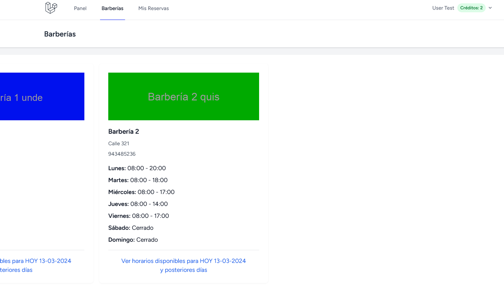
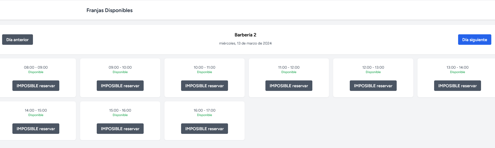
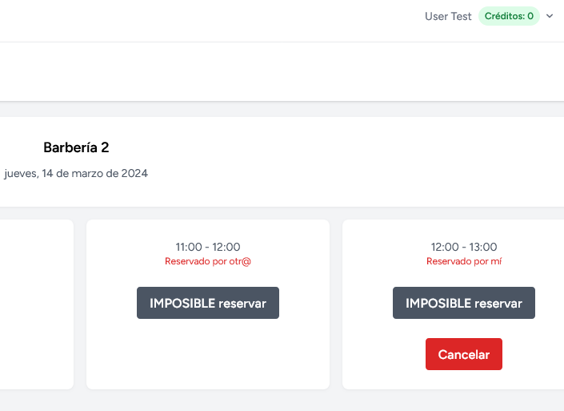
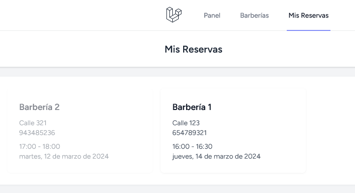
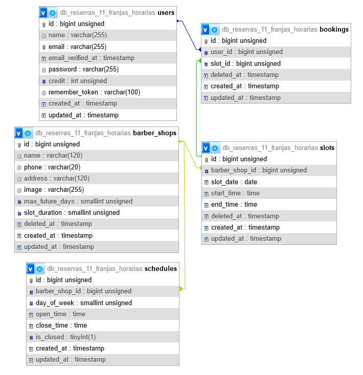

## reservas_franjas_horarias

Proyecto realizado con la versión 11.x de desarrollo de Laravel.

A grandes rasgos, se trata de una aplicación por medio de la cuál los comercios que estén registrados en ella ofrezcan espacios dentro de su horario semanal para los potenciales usuarios cliente que los puedan reservar.

Cada comercio podrá personalizar su configuración en cuanto a:

- horarios de apertura y cierre, y días festivos.
- tiempo a asignar a las franjas horarias de reserva.

Para realizar reservas:

- el usuario deberá estar registrado.
- deberá disponer de créditos.
- no se podrá reservar:
  - si el día de la reserva ya pasó o si es el día actual.
  - si esa franja horaria ya está ocupada por otro usuario.
  - si no se dispone de suficientes créditos para ello.

El usuario tendrá la oportunidad de cancelar sus reservas siempre que lo haga antes del día de la propia reserva. No se podrá cancelar en el día de la reserva.
Cuando cancele una reserva, recuperará el crédito gastado en ella.la reserva  siempre que se registren en la plataforma y dispongan de créditos para realizar reservas o que la reserva en cuestión sea para un día que no sea el actual o que ya esté ocupada por otro usuario.

Algunas de las funcionalidades incluidas:

- Listado de comercios con sus horarios de apertura y cierre.
- Listado y navegación por los diferentes días de un comercio y sus posibles opciones de reserva durante dichos días siempre partiendo del día actual a los supuestos 7 días siguientes, más o menos.
- Posibilidad de realizar reservas siempre en días posteriores al actual y cancelar antes del día de la reserva.
- Listado de las reservas realizadas.
- Otros:
  - comando que genera, automáticamente, los Slots o franjas horarias de reserva de cada comercio en función de la configuración personalizada de cada uno de ellos.

## Modelo de Datos

